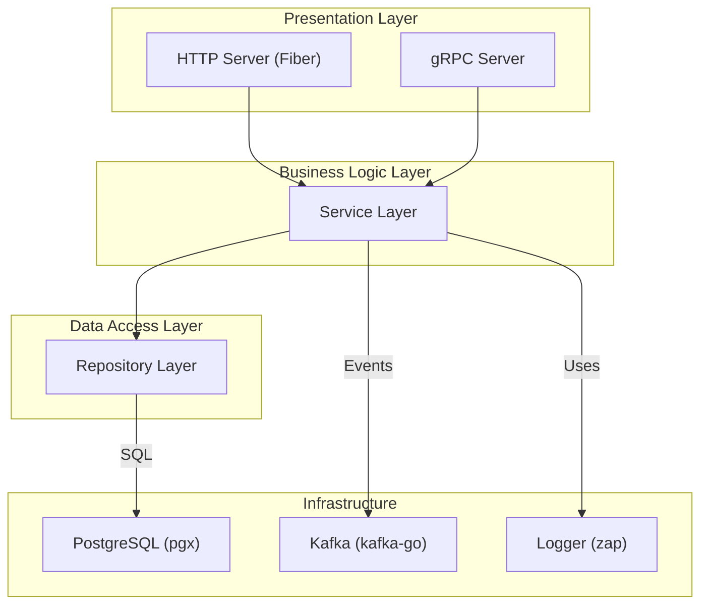

# Go Microservice Template

A production-ready, feature-rich template for building Go microservices. This template follows Clean Architecture principles and includes a variety of common components to accelerate development.

## Features

- **Dual API Support**: Expose logic via both HTTP (Fiber) and gRPC.
- **Clean Architecture**: A clear separation of concerns between layers (API, Business Logic, Data Access).
- **Configuration Management**: Centralized configuration loading from environment variables (`.env` file support).
- **Database Integration**: Ready-to-use PostgreSQL integration with `pgx` and a query builder.
- **Database Migrations**: Integrated with `golang-migrate` for managing database schema changes.
- **Structured Logging**: Production-grade logging with `zap` and log rotation with `lumberjack`.
- **Message Queue**: Kafka producer/consumer examples using `kafka-go`.
- **API Documentation**: Automatic Swagger/OpenAPI documentation generation.
- **Containerization**: Full Docker and Docker Compose support for easy development and deployment.
- **Graceful Shutdown**: Coordinated shutdown of all services (HTTP, gRPC, DB connections).

## Architecture

This template follows the principles of **Clean Architecture**. The dependencies are structured to flow inwards, with the business logic at the core, independent of any delivery mechanism or data source.



- **Presentation Layer (`internal/controller`)**: Contains the HTTP and gRPC handlers. This layer is responsible for decoding requests, calling the appropriate service methods, and encoding responses.
- **Business Logic Layer (`internal/service`)**: Holds the core business logic. It is completely independent of the presentation and data access layers.
- **Data Access Layer (`internal/repository`)**: Implements the interfaces defined by the service layer to interact with the database. It handles all the data persistence logic.

## Technology Stack

- **Language**: Go
- **Web Framework**: [Fiber](https://gofiber.io/)
- **gRPC**: [gRPC-Go](https://grpc.io/)
- **Database**: [PostgreSQL](https://www.postgresql.org/)
- **Database Driver**: [pgx](https://github.com/jackc/pgx)
- **SQL Query Builder**: [Squirrel](https://github.com/Masterminds/squirrel)
- **Messaging**: [kafka-go](https://github.com/segmentio/kafka-go)
- **Logging**: [Zap](https://github.com/uber-go/zap)
- **Configuration**: [env](https://github.com/caarlos0/env)
- **API Documentation**: [Swagger](https://swagger.io/)
- **Migrations**: [golang-migrate](https://github.com/golang-migrate/migrate)
- **Containerization**: Docker, Docker Compose

## Project Structure

```
├── api/                  # OpenAPI specs and Protobuf definitions
├── cmd/server/           # Application entrypoint
├── config/               # Configuration loading
├── internal/             # Main application code
│   ├── app/              # Service initialization and graceful shutdown
│   ├── controller/       # HTTP/gRPC handlers, routes, and middleware
│   ├── entity/           # Core domain models
│   ├── service/          # Business logic layer
│   └── repository/       # Data access layer
├── pkg/                  # Shared utility packages
├── migrations/           # Database migration files
├── scripts/              # Helper scripts (e.g., swagger generation)
├── .env.example          # Example environment variables
├── Dockerfile            # Docker build file
├── docker-compose.yml    # Docker Compose for development services
└── Makefile              # Commands for building, running, and testing
```

## Getting Started

### Prerequisites

- Go (1.21+)
- Docker & Docker Compose
- [golang-migrate](https://github.com/golang-migrate/migrate/tree/master/cmd/migrate) CLI

### 1. Configuration

Copy the example environment file and update it with your settings.

```sh
cp .env.example .env
```

The `.env` file includes configuration for the application, database, Kafka, and other services.

### 2. Build Dependencies

Generate gRPC code from the `.proto` definitions:

```sh
make proto
```

### 3. Run Services

Use Docker Compose to spin up the required infrastructure (PostgreSQL, Kafka, etc.).

```sh
docker-compose up -d
```

### 4. Run Database Migrations

Apply the SQL migrations to your database.

```sh
make migrate-up
```

### 5. Run the Application

```sh
make run
```

The application will now be running and accessible:

- **HTTP Server**: `http://localhost:8000`
- **gRPC Server**: `localhost:9000`

### 6. API Documentation

With the application running in a `dev` environment, you can access the Swagger UI:
`http://localhost:8000/swagger/index.html`

## License

This project is licensed under the MIT License. See the [LICENSE](LICENSE) file for details.
